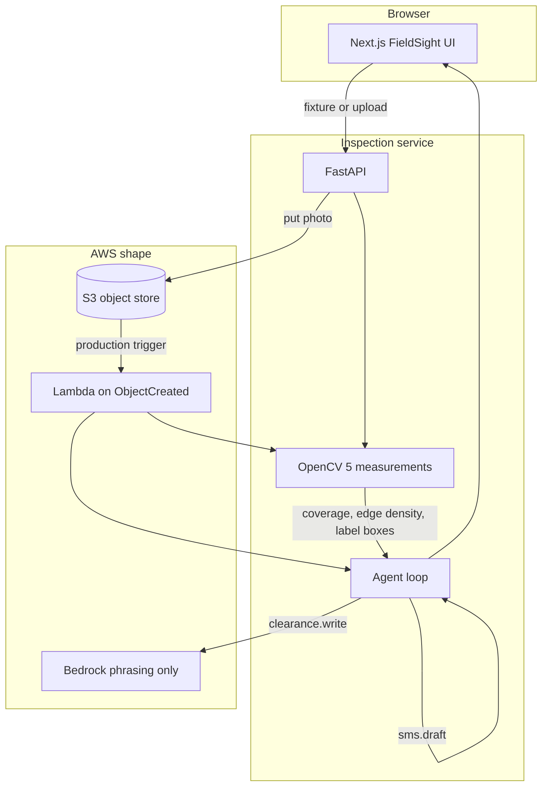

# FieldSight technical report

OpenCV AI Competition 2026 (powered by AWS). Target: Agentic Vision Award.

Author: Cubiczan / Sam Desigan.

Screen recording: follow [DEMO.md](DEMO.md). The file `docs/fieldsight-demo.mp4` is committed after the recording exists. It is not in the repo yet.

## Problem

A service tech opens a mechanical room, shoots one photo, and has to decide in the next minute whether the crew can keep working. The things that matter in that frame are ordinary and visual: is someone in a hi-vis vest, is an electrical cover off, is there a warning label beside the gear. Today that check lives in someone's head, and the office hears about it late, by phone, with no picture of why.

FieldSight runs the check on the photo and turns the result into the next action: a clearance, a hold, or an urgent ticket plus a text the office can send.

## Users

Primary user: a tech or crew lead on an HVAC, electrical, or plumbing call. They are standing in a room, often with gloves, and they need a large CLEAR / HOLD / ESCALATE, not a chat transcript.

Secondary user: office dispatch. They receive a drafted SMS and, when the panel reads open, a ticket id they can work.

FieldSight does not replace a qualified electrical worker. The clearance note says that in the text the crew sees.

## Architecture

Local demo path: the browser talks to Next.js on port 43123. Next rewrites `/api/vision/*` to FastAPI on port 43124. FastAPI stores the image, runs OpenCV, then runs the agent. The UI plays the tool trace back one step at a time so the branch is visible.

The agent is not a chatbot wrapped around a fixed label. OpenCV returns measurements only. Thresholds and tool choice live in `backend/app/agent.py`.

| Step | Tool | When it runs |
| --- | --- | --- |
| Perceive | `vision.read` | Always. Reports vest coverage, panel candidates, label regions. |
| Perceive | `panel.measure` | Only if a panel-shaped contour exists. Compares interior Canny density to 8%. |
| Decide | `policy.check` | Always. Maps the numbers to CLEAR, HOLD, or ESCALATE. |
| Act | `ticket.create` | Only when the decision is ESCALATE. Otherwise the step is recorded as skipped, with the reason. |
| Act | `sms.draft` | Always, but the recipient and the body come from the branch. |
| Act | `clearance.write` | Always. Records which tools ran. Optional Bedrock pass may rephrase and may not change the decision word. |

Trade is an input to the action, not a second vision model. An open panel on a plumbing call still escalates, and the ticket title becomes "Electrical exposure on a plumbing call."

## OpenCV

Package: `opencv-python-headless==5.0.0.93` (OpenCV 5).

Working image is resized to a max width of 960. Stages, in order:

1. **Hi-vis vest.** HSV mask for orange (hue 4–22) plus yellow-green reflective strips (hue 33–48). Warning-label yellow (hue 22–32) is outside both bands, so a placard is not a vest. Morphological close, then the largest contour's area over the image area. The agent treats coverage at or above 4% as a torso-sized vest.
2. **Edges.** Grayscale, Gaussian blur, Canny (60, 150). A thumbnail of this map is drawn on the overlay so the edge step is visible.
3. **Panel candidates.** A dark mask (value under 75) finds an open interior. A light, low-saturation mask finds a latched metal door. Contours must be panel-shaped: area 4.5–35% of the frame, aspect between 0.4 and 2.1, and the mask must fill at least half the box so a thin door frame is not a panel. Edge density is the share of Canny pixels inside the box.
4. **Warning label.** Yellow and red masks, closed with a small rectangle kernel. Regions between 0.18% and 8% of the frame are returned as boxes. The agent keeps a region only when its center sits within 90 pixels of the chosen panel.

The agent calls a dark region **open** when its edge density is at least 8%. Breaker rows clear that bar on the fixtures (about 10.5%). A latched door sits near 1.5%. Below 8%, a metal door is **closed**. If OpenCV found no panel contour, `panel.measure` is skipped.

Overlay colors: green vest, blue latched cover, red open interior, yellow label box.

## AWS

The demo runs with no credentials.

| Piece | Local demo | When credentials are set |
| --- | --- | --- |
| Photo storage | `LocalStore` writes `var/uploads/` and returns `s3://fieldsight-local/inspections/<sha>.jpg` | `S3Store` calls `boto3` `put_object`. Bucket from `FIELDSIGHT_S3_BUCKET`. Optional `AWS_ENDPOINT_URL` for MinIO or LocalStack. |
| Analysis API | FastAPI process | Same app on App Runner, ECS, or a Lambda container image. The OpenCV wheel is large for a zip Lambda; a container image is the practical deploy. |
| S3 trigger | Not used locally | `backend/lambda_handler.py` handles `ObjectCreated`, runs the same vision and agent code, writes `<key>.inspection.json` beside the photo. |
| Language model | Clearance note is a template | `BEDROCK_MODEL_ID` sends the finished note through `bedrock-runtime` `converse`. If the call fails, or the reply drops the decision word, the template is kept. |

Environment names are listed in `.env.example`.

Suggested production flow: the phone uploads to S3, Lambda runs this handler, and the result JSON is what dispatch reads. Bedrock is a phrasing layer. The branch is the OpenCV policy, so a model outage cannot quietly turn an open panel into CLEAR.

## Evaluation

Fixtures are generated by `backend/scripts/generate_samples.py` and checked in under `public/samples/`. `cd backend && pytest -q` asserts the decisions and the tool branch.

| Fixture | Vest coverage | Panel edge density | Label near panel | Decision | `ticket.create` |
| --- | --- | --- | --- | --- | --- |
| Vest on, panel latched | 6.8% | 1.5% closed | yes | CLEAR | skipped |
| No hi-vis vest | 0% | 1.5% closed | yes | HOLD | skipped |
| Open load center | 0% | 10.6% open | no | ESCALATE | executed |
| Vest on, cover off | 6.8% | 10.5% open | no | ESCALATE | executed |

Thresholds: vest 4%, open-panel edges 8%. The two ESCALATE rows share a decision and differ in the ticket summary and the SMS, because vest coverage changed. A unit test also flips synthetic measurements with no image and checks that the tool list changes. Another test removes every panel candidate and checks that `panel.measure` is skipped.

This is a fixture eval, not a field trial. It proves the branch. It does not measure precision on real mechanical rooms.

## Limitations

- The vest check is an orange / yellow-green color mask. An orange cone, a sunset wall, or a safety fence can pass it. A dirty or navy vest will fail it.
- "Open panel" means a dark rectangle with dense edges. A shadowed door, a dark window, or a tool bag can look similar. A light-colored open cabinet can be missed.
- The label check is color and location, not OCR. It cannot read "480 VOLTS" or tell a yellow pipe label from an arc-flash placard except by size and hue.
- One still frame. No motion, no thermal, no voltage.
- Synthetic fixtures are drawn to these masks so the three-minute demo is stable. A real upload can disagree with a person standing in the room.
- Ticket ids and SMS are simulated tools. Nothing is sent.

## Responsible use

- Show the result as a screen for the crew, then have a person confirm the equipment. Do not use the note as lockout/tagout, as an energized-work permit, or as proof the gear is dead.
- OSHA 1910.333 and NEC 110.16 are cited as the rules the heuristic is aimed at. FieldSight is not a compliance determination.
- Photos of customer sites are sensitive. The local demo writes them under `var/uploads/`. A real deploy needs a retention limit, access control on the bucket, and a reason the office is allowed to keep the image.
- Do not point this at people for surveillance. The vest measurement exists so the crew can see whether PPE is in the work photo, not to score workers.
- If Bedrock is enabled, it may only rephrase the note. The decision has already been made from the measurements.
